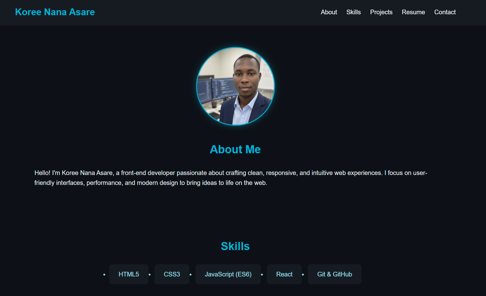

# Koree Nana Asare Portfolio



## Overview

This is the personal portfolio of **Koree Nana Asare**, a front-end developer passionate about creating clean, responsive, and user-friendly web experiences.  
The portfolio showcases skills, projects, resume, and contact information in a modern, interactive layout.

---

## 🔹 Features

- **Responsive Design:** Fully optimized for desktop, tablet, and mobile devices.  
- **Interactive UI:**
  - Floating animations for profile picture and project cards.
  - Smooth hover effects and gradient buttons.
  - Scroll reveal animations for sections.
  - Scroll-to-top button with fade-in/out animation.
- **Projects Section:** Each project card includes description, challenges, solutions, GitHub link, and live demo.  
- **Skills Section:** Highlighted skills with hover effects.  
- **Contact Section:** Direct email, LinkedIn, and GitHub links with interactive buttons.  
- **Accessibility:** `aria-labels` added, semantic HTML, and proper color contrast.  
- **Performance:** Lazy loading of images for faster page load.

---

## 💻 Technologies Used

- HTML5
- CSS3 (Flexbox, Grid, Animations)
- JavaScript (ES6)
- Responsive Design Principles
- Git & GitHub for version control

---

## 🚀 Getting Started

### 1. Clone the Repository
```bash
git clone https://github.com/asare4/portfolio.git
